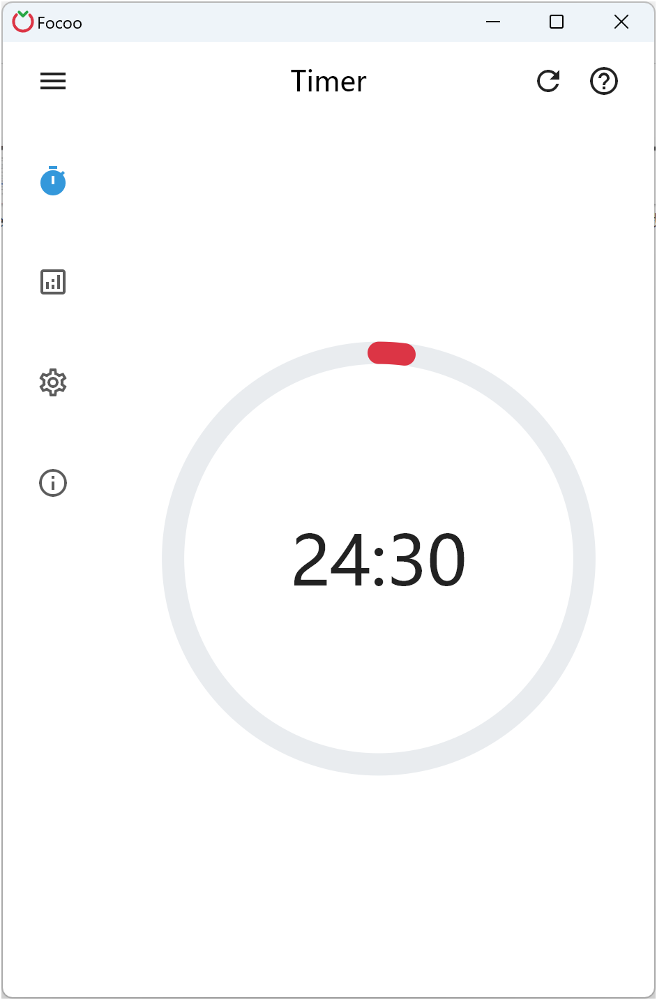
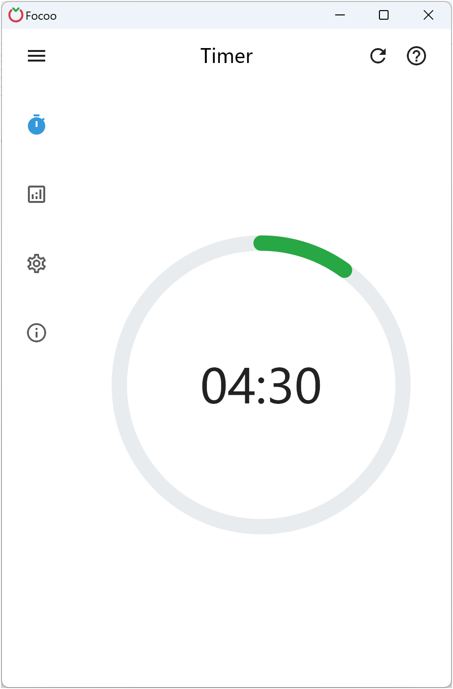
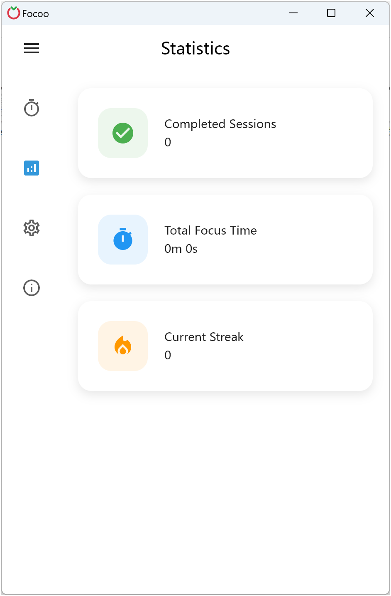
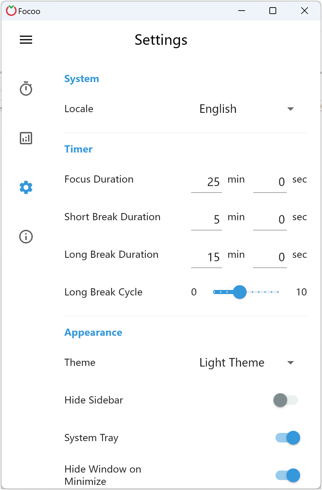

  

# Focoo

Focoo ist ein schöner und praktischer Pomodoro-Timer.

## Erscheinungsbild

  
  
  
  

## Installation

## Einführung

Focoo ist eine einfache und intuitive Produktivitätsanwendung basierend auf der Pomodoro-Technik, die darauf ausgelegt ist, Ihnen zu helfen, sich besser auf Aufgaben zu konzentrieren und Ihre Produktivität zu steigern. Sie erhalten positives Feedback, wenn Sie Ihre Fokussitzungen abschließen.

Lassen Sie Focoo Sie dabei führen, Prokrastination zu überwinden und Schritt für Schritt persönliche Durchbrüche zu erzielen!

Anwendbare Szenarien:
- Lernen und Wiederholen
- Arbeit und Büroaufgaben
- Persönliche Disziplin
- Gewohnheitsbildung
- Meditationspraxis
...

Hauptfunktionen:
- Saubere und intuitive Benutzeroberfläche
- Fokussierte Funktionalität mit kleiner App-Größe
- Flexible Timer-Einstellungen, präzise bis auf die Sekunde
- Hochgradig anpassbar mit reichlich Konfigurationsoptionen
- Verfügbar auf Windows, Linux und macOS; Android und iOS demnächst
- Verfügbar in mehr als 10 Sprachen

## Veröffentlichungen

Siehe Versionsverlauf, Änderungsprotokoll und Screenshots unter [releases](releases/README.md).

## Lizenz

Focoo ist kommerzielle Software, dieses Repository bietet Benutzern einen Ort, um Probleme zu melden und Vorschläge einzureichen.

