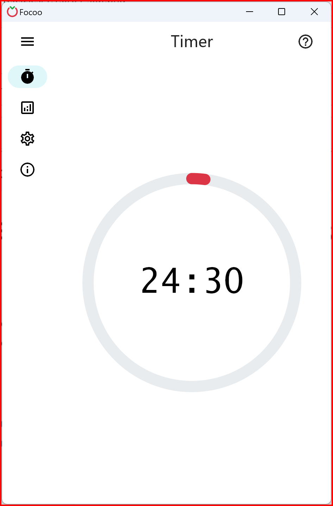
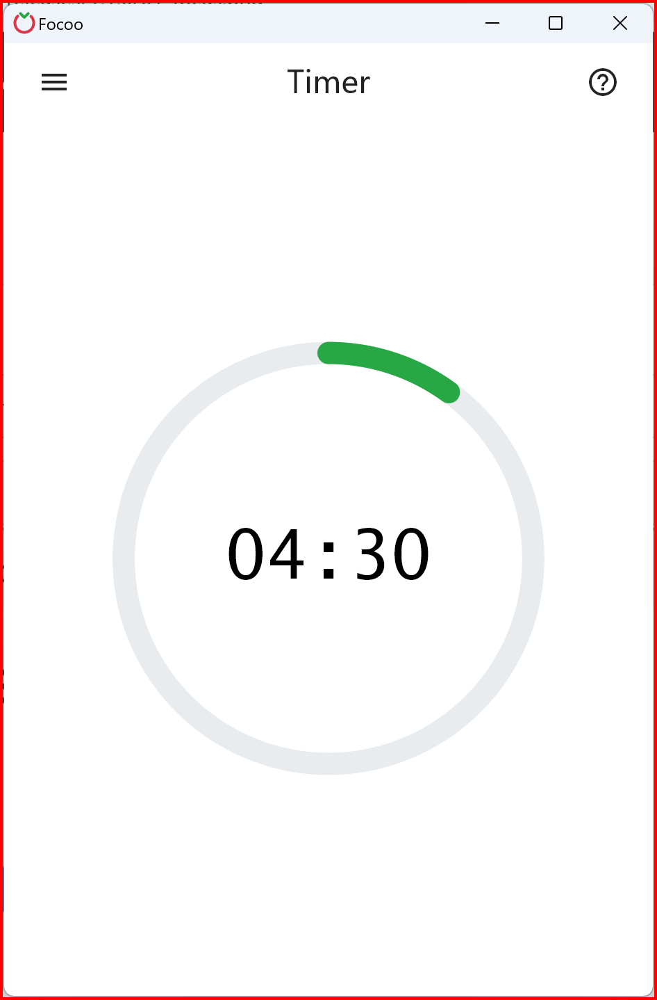
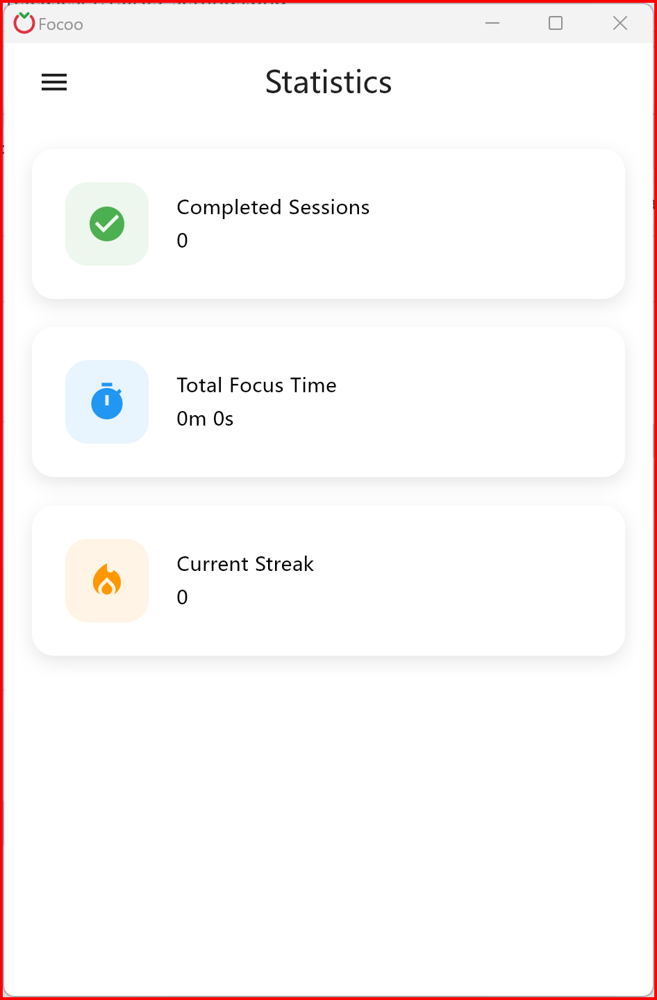
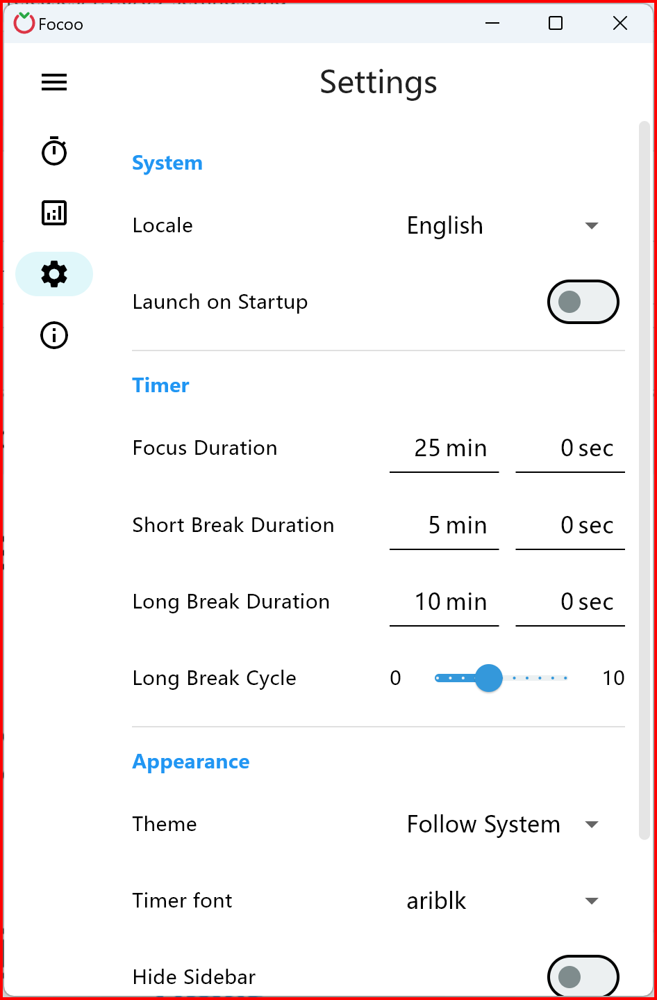

  

# Focoo

Focoo is a beautiful and practical Pomodoro timer.

## Appearance

  
  
  
  

## Installation

## Introduction

Focoo is a simple and intuitive productivity application based on the Pomodoro Technique, designed to help you concentrate better on tasks and enhance your productivity. You will receive positive feedback upon completing your focused sessions. 

Let Focoo guide you to overcome procrastination and achieve personal breakthroughs step by step! 

Applicable Scenarios:
- Studying and Reviewing
- Work and Office Tasks
- Personal Discipline
- Habit Building
- Meditation Practice
...

Key Features:
- Clean and intuitive interface
- Focused functionality with a small app size
- Flexible timer settings, precise down to the second
- Highly customizable with abundant configuration options
- Available on Windows, Linux, and macOS, with Android and iOS coming soon
- Available in 10+ languages

## Releases

See version history, changelog, and screenshots in [releases](releases/README.md).

## License

Focoo is commercial software, this repo provides users with a place to report problems and submit suggestions.

